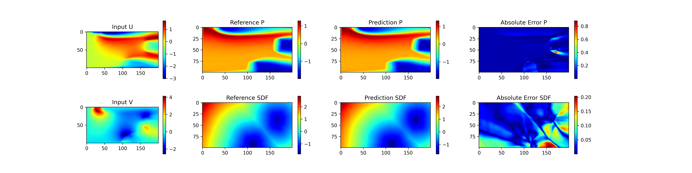

# How to train/inference

## 1. train FAE

``` sh
python main.py
```

then we get the pretrained FAE weights in `outputs_gifm_fae/xxx/xxx_train/latest.pdparams`

## 2. train DiT

``` sh
python main.py -cn gifm_diffusion.yaml FAE.pretrained_model_path=outputs_gifm_fae/xxx/xxx_train/latest.pdparams
```

then we get the pretrained DiT weights in `outputs_gifm_dit/xxx/xxx_train/latest.pdparams`

## 3. inference

after train FAE and DiT, we can:
1. use **FAE.encoder** to encode the given physical field,
2. integrate from 0 to 1 with **DiT**,
3. use **FAE.decoder** to decode the integrated result to prediction field.

``` sh
python main.py -cn gifm_diffusion.yaml mode=eval EVAL.pretrained_model_path=outputs_gifm_dit/xxx/xxx_train/checkpoints/latest
```

preview result:


## 4. pretrained weights

- [FAE](https://paddle-org.bj.bcebos.com/paddlescience/models/fundiff/fundiff_turbulence_mass_transfer_fae_pretrained.pdparams)
- [DiT](https://paddle-org.bj.bcebos.com/paddlescience/models/fundiff/fundiff_turbulence_mass_transfer_dit_pretrained.pdparams)
